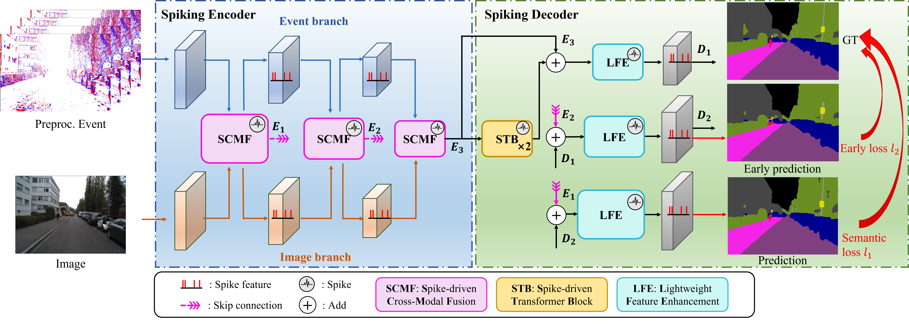

# SEINet
SEINet: Lightweight Spike-driven Event-Image Fusion Network for Accurate and Efficient Semantic Segmentation

# Dataset
To proceed, please download the DDD17/DSEC-SEMANTIC dataset on your own.
# Abstract
Semantic segmentation is critical for intelligent robotics to understand their environment, where accurate and efficient segmentation in high-dynamic scenarios with lower latency and lower energy consumption is the ultimate goal. However, existing models either rely solely on event streams or image frames or fuse them directly without fully capturing the spatiotemporal correlation inherent in both modalities, resulting in degraded accuracy and increased energy costs, hindering their application in energy-constrained autonomous systems. In this work, we propose SEINet, a lightweight full Spike-driven Event-Image fusion Network that fine-grainedly fuses two modalities, while utilizing the energy efficiency of spiking neural networks (SNNs). Specifically, to enhance the feature interaction and complementarity in the encoder, we design a spike-driven cross-modal fusion (SCMF) module that integrates the dynamic cues from events and spatial details from images through a dedicated modality-aware extraction stage and cross-modal fusion stage. Following that, we introduce the spike-driven transformer block (STB) to aggregate the fused multi-modal information efficiently from the encoder. Then, a spike-driven lightweight feature enhancement (LFE) module is proposed to refine feature representation and facilitate deep-shallow feature fusion. Finally, extensive experimental results demonstrate that SEINet reaches promising 67.34\% and 58.09\% mIoU on DDD17 and DSEC-Semantic datasets, respectively, while achieving at most 72.83× and 100.26× less energy compared to state-of-the-art (SOTA) methods.
